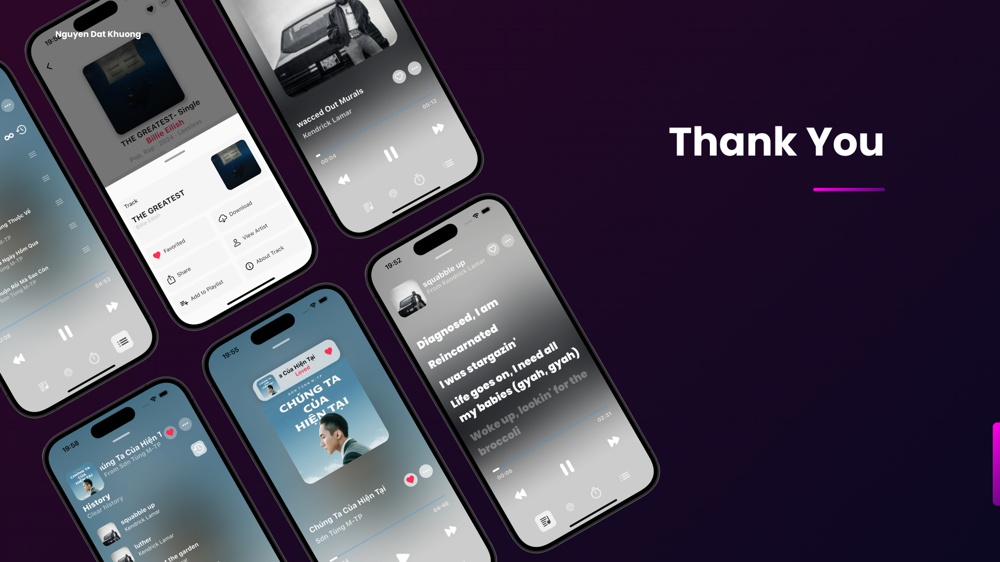

# Sound Sphere - Music Streaming App

Sound Sphere is a modern music streaming application that offers a seamless and immersive audio experience. Built with Firebase Authentication and a NestJS-powered backend, it provides a complete set of features for discovering, playing, and managing music.

## Features

- **User Authentication**
  - Secure login and sign-up with Firebase Authentication.

- **Music Streaming**
  - Stream high-quality audio with a sleek and intuitive player.
  - Support for playlists, favorites, and recently played songs.

- **Lyrics Display**
  - View real-time lyrics synced with the song playback.

- **Playlist Management**
  - Create, edit, and share custom playlists.

- **Music Discovery**
  - Explore trending, recommended, and new releases.

- **Offline Mode**
  - Download songs for offline listening.

- **Dark Mode UI**
  - Stylish and user-friendly interface with dark mode support.

## Screenshots



## Demo & Preview

- **App Preview:** [Sound Sphere Website](https://soundspherestreaming.my.canva.site/)  
- **YouTube Demo:** [Watch on YouTube](https://www.youtube.com/watch?v=NcnI-TaL3xk)  

[](https://www.youtube.com/watch?v=NcnI-TaL3xk)

## Installation

1. Clone the repository:
   ```sh
   git clone https://github.com/your-repo/sound-sphere.git
   ```

2. Navigate to the project directory:
   ```sh
   cd sound-sphere
   ```

3. Install dependencies:
   ```sh
   npm install
   ```

4. Run the app:
   ```sh
   npm start
   ```

## Technologies Used

- **Frontend:** Flutter
- **Backend:** NestJS
- **Authentication:** Firebase
- **Database:** MongoDB / Firestore

## Contributing

We welcome contributions! If you'd like to improve Sound Sphere, feel free to fork the repository and submit a pull request.